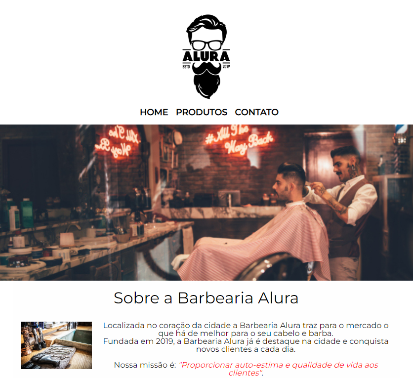

<h1 align="center"> Projeto Barbearia Alura </h1>

  Este Projeto foi Criado no Curso de HTML e CSS  

  <a href="#-tecnologias">Tecnologias</a>&nbsp;&nbsp;&nbsp;|&nbsp;&nbsp;&nbsp;
  <a href="#-projeto">Projeto</a>&nbsp;&nbsp;&nbsp;

 

  

 
 
## Tecnologias
---

Esse projeto foi desenvolvido com as seguintes tecnologias:

- HTML e CSS
- Git e Github

 

##  Projeto
---
  - O Projeto foi criado em cima de um site de um comércio de Barbearia 
   
  Onde o Cliente pode acessar o site e conhecer um pouco sobre o comércio 
   
   
  Como trabalham, Contato, Localização, Valores e Horários de atendimentos.

  [Acesse o Projeto](https://allesoares95.github.io/projeto-alura-barbearia/)